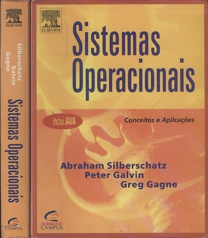
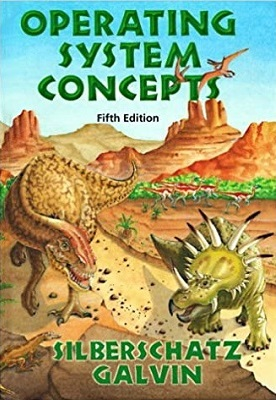

## Apresentação

Estas são minhas notas de aula de quando fui professor da disciplina Sistemas Operacionais em **2003** na faculdade IMAPES (Instituto Manchester Paulista de Ensino Superior) - Sorocaba/SP.

## Referência

As notas são baseadas no famoso "Livro dos Dinossauros", ou **Sistemas Operacionais: Conceitos e Aplicações** de Abraham Silberschatz e Peter Galvin e servem como um resumo do mesmo.

## Conteúdo

Aula | Assunto                                 | Notas
-----|-----------------------------------------|-----------
0    | Objetivos, Tópicos e Bibliografia       | [Apresentação](aula00.md)
1    | Sistema Operacional e Conceitos Básicos | [Tópicos](aula01top.md) / [Aula](aula01.md)
2    | Tipos de Sistema operacional            | [Tópicos](aula02top.md) / [Aula](aula02.md)
3    | Visão geral dos sistemas de computação  | [Aula](aula03.md)
4    | Arquitetura de Sistemas Operacionais    | [Aula](aula04.md)
5    | Gerência de Processos                   | [Tópicos](aula05top.md) / [Aula](aula05.md)
6    | Gerência de Memória                     | [Aula](aula06.md)
7    | Sistema de Arquivos                     | [Tópicos](aula07top.md) / [Aula](aula07.md)
8    | Sistema de Entrada e Saída              | [Aula](aula08.md)

## Laboratórios

As notas de aula de laboratório estão um tanto desatualizadas, como seria de se esperar, mas decidi mantê-las por seu "valor histórico".

Laboratório | Assunto                                                | Notas
------------|--------------------------------------------------------|-----------
1           | Utilização do modo gráfico do Linux                    | [Tópicos](lab01top.md) / [Aula](lab01.md)
2           | Mais sobre o modo gráfico                              | [Aula](lab02.md)
3           | Utilização do modo console do Linux                    | [Aula](lab03.md)
4           | Arquivos, usuários e permissões                        | [Aula](lab04.md)
5           | Gerenciamento de processos no Linux                    | [Aula](lab05.md)
6           | Memória virtual, sistemas de arquivo, programando em C | [Aula](lab06.md)
Extra       | Instalação do Linux                                    | [Aula](linux00.md)
